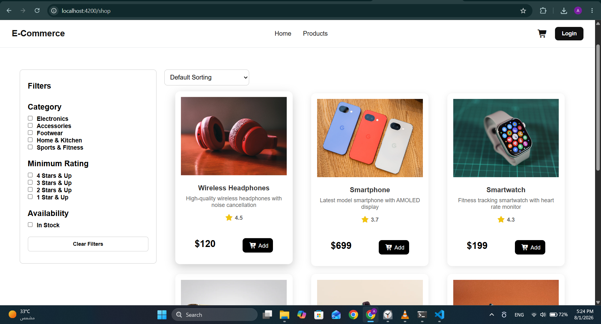
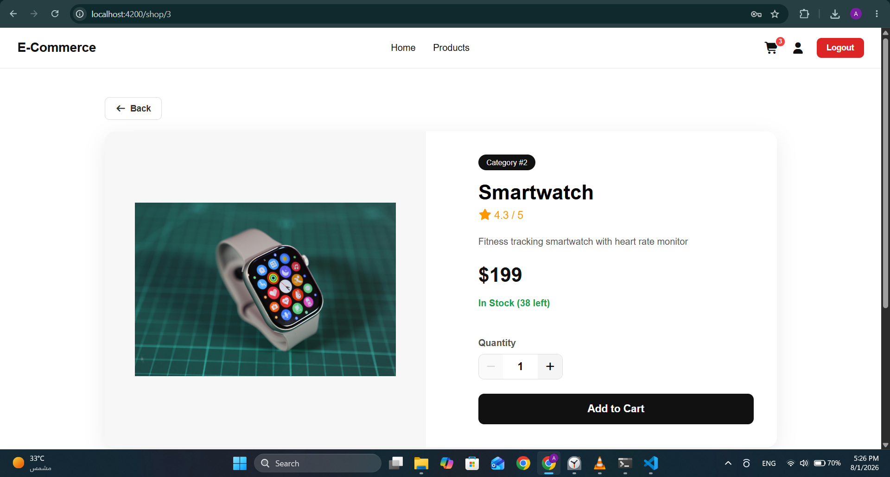
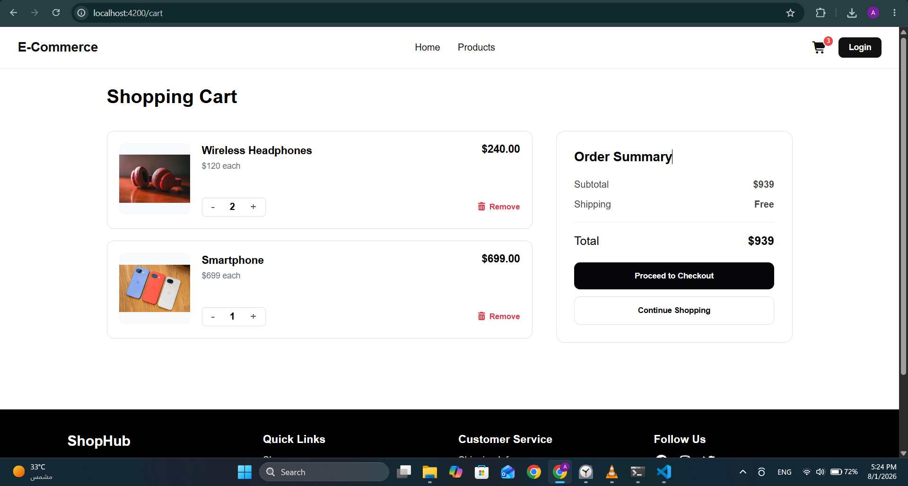
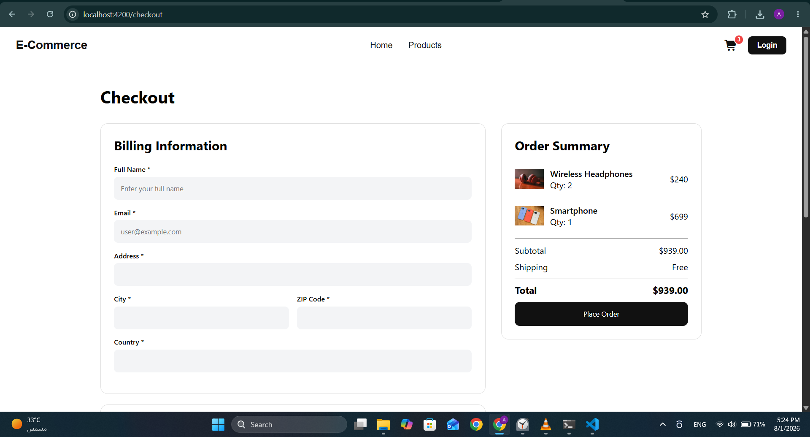
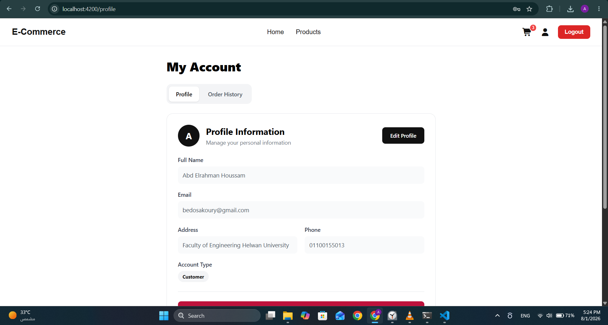

# Angular E-Commerce Store

A modern **E-Commerce web application** built with **Angular 19** using standalone components, Angular's modern control flow (`@if`, `@for`), Reactive Forms, and RxJS.

The project demonstrates the complete shopping experience—from browsing products to placing orders—while following a clean service-based architecture and modern Angular development practices.

---

# Live Demo

**Frontend (Vercel)**

https://e-commerce-project-two-mauve.vercel.app/

> **Note**
>
> The deployed website contains only the Angular frontend.
> Since the backend uses **json-server**, features that require a backend (Login, Signup, Cart, Checkout, Profile, and Orders) are available only when running the project locally.

---

# Features

## Shopping Experience

* Browse products on the Home and Shop pages.
* Product details page with stock, description, rating, and quantity selector.
* Category filtering.
* Rating filtering.
* In-stock filtering.
* Product sorting:

  * Default
  * Price (Low → High)
  * Price (High → Low)
  * Rating
* Client-side pagination.

---

## Cart

* Add products to cart.
* Increase or decrease quantities.
* Remove products.
* Live cart counter in the navbar using RxJS `BehaviorSubject`.
* Prevent adding more items than available stock.

---

## Checkout

* Reactive checkout form.
* Shipping information validation.
* Credit card validation.
* Cash on Delivery option.
* Creates orders.
* Automatically decreases product stock.
* Clears the cart after successful checkout.

---

## Authentication

* User registration.
* Login.
* Logout.
* Duplicate email validation.
* Session persistence using `sessionStorage`.

---

## User Profile

Protected using Angular Route Guards.

Includes:

* My Information

  * View profile
  * Edit profile information

* Order History

  * View previous orders
  * Order totals
  * Purchased products

---

## Shared Components

* Responsive Navbar
* Responsive Footer
* Reusable Alert Component
* Pagination Component
* Product Filter Component

---

# Angular Concepts Used

* Standalone Components
* Angular Router
* Route Guards
* Reactive Forms
* Dependency Injection
* RxJS
* BehaviorSubject
* HttpClient
* Component Communication
* Modern Control Flow (`@if`, `@for`)
* Signals-compatible Angular Architecture

---

# Tech Stack

| Layer            | Technology             |
| ---------------- | ---------------------- |
| Framework        | Angular 19             |
| Language         | TypeScript             |
| Styling          | HTML5, CSS3            |
| Icons            | Font Awesome           |
| Forms            | Angular Reactive Forms |
| Routing          | Angular Router         |
| State Management | RxJS                   |
| HTTP             | HttpClient             |
| Mock Backend     | json-server            |
| Version Control  | Git & GitHub           |
| Deployment       | Vercel                 |

---

# Project Structure

```text
src/app/
├── Components/
│   ├── alert/
│   ├── filter/
│   ├── footer/
│   ├── form-information/
│   ├── navbar/
│   ├── orders/
│   └── pagination/
│
├── Pages/
│   ├── home/
│   ├── shop/
│   ├── product/
│   ├── cart/
│   ├── checkout/
│   ├── login/
│   ├── signup/
│   └── profile/
│
├── Services/
│   ├── auth.service.ts
│   ├── cart.service.ts
│   ├── order.service.ts
│   ├── products.service.ts
│   └── user.service.ts
│
├── Guards/
│   ├── auth.guard.ts
│   └── logged.guard.ts
│
├── Model/
│   ├── product.ts
│   ├── category.ts
│   ├── user.ts
│   ├── cart.ts
│   ├── order.ts
│   ├── sorting.ts
│   └── sortingType.ts
│
└── app.routes.ts
```

---

# Routes

| Route             | Description     |
| ----------------- | --------------- |
| `/home`           | Home Page       |
| `/shop`           | Products        |
| `/shop/:id`       | Product Details |
| `/cart`           | Shopping Cart   |
| `/checkout`       | Checkout        |
| `/login`          | Login           |
| `/signup`         | Register        |
| `/profile`        | User Profile    |
| `/profile/orders` | Order History   |

---

# Data Model

The application uses a local **json-server** backend with the following resources:

* Categories
* Products
* Users
* Cart
* Orders

---

# Getting Started

## Prerequisites

* Node.js
* npm
* Angular CLI (optional)

---

## Clone the Repository

```bash
git clone https://github.com/abdosakoury78/E-commerce-Project.git
cd <project-folder>
```

---

## Install Dependencies

```bash
npm install
```

---

## Run the Backend

Start the mock REST API:

```bash
npm run start-json-server
```

The backend will be available at:

```text
http://localhost:3000
```

---

## Run Angular

Open another terminal and execute:

```bash
npm start
```

Then visit:

```text
http://localhost:4200
```

---

# Future Improvements

* ASP.NET Core Backend
* SQL Server Database
* JWT Authentication
* Admin Dashboard
* Product Search
* Wishlist
* Product Reviews
* Stripe Payment Integration
* Image Uploads
* Cloud Database

---

# Current Limitations

* Uses **json-server** as a mock backend.
* Authentication is client-side only.
* Passwords are stored in plain text for demonstration purposes.
* No real payment gateway.
* Not intended for production use.

---

## Screenshots

### Shop


### Product Details


### Cart


### Checkout


### Profile

---

# Author

**Abdelrahman Houssam**

Computer Engineering Graduate

Frontend Developer (Angular)

GitHub Portfolio Project
